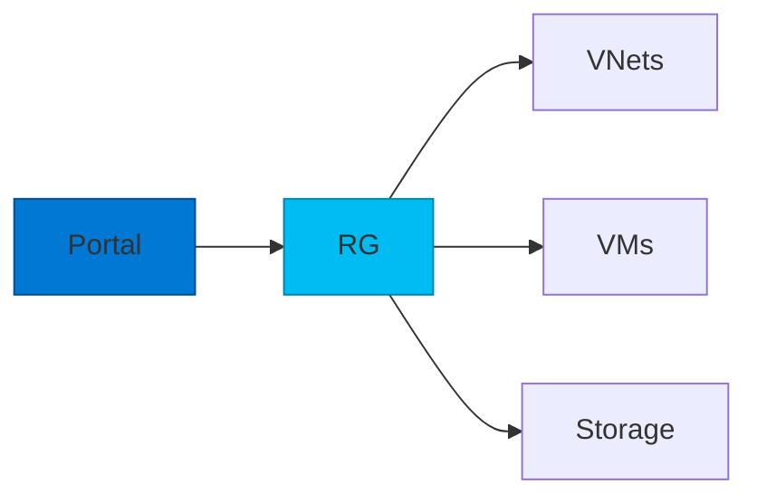
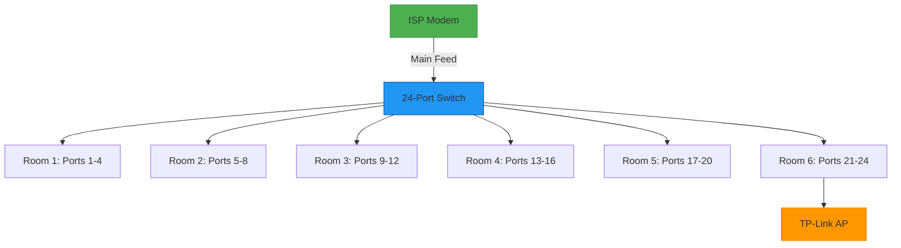

 
  # **👋 Nyasha Mahara | Cloud & IT Support Engineer**  
  **📍 Exmouth, UK | 📞 +44 (0)7909 524842 | ✉️ millernyasha@gmail.com**  
 

<b>🔍 About Me</b> (Click to expand)

### **☁️ Passionate IT Professional Transitioning to Cloud Engineering**  
With over 5 years of hands-on experience in IT support and system administration, I'm now channeling my technical expertise toward cloud technologies. Currently pursuing Microsoft AZ-900 (Azure Fundamentals) and AZ-104 (Azure Administrator) certifications, I'm building proficiency in Azure resource provisioning, virtual machine management, and cloud networking.

What drives me is the relentless pursuit of mastering new technologies - whether it's implementing RBAC in Azure AD, optimizing cloud costs, or troubleshooting complex network infrastructures. My recent projects include deploying a 7-room office network (saving £1,500 by repurposing hardware) and building Azure environments from scratch.

### **I thrive in environments where I can**:

✔ Solve technical challenges with scalable solutions  
✔ Bridge the gap between traditional IT and cloud infrastructure  
✔ Continuously learn through certifications and hands-on labs  
✔ Optimize systems that directly impact business productivity  

When not studying Azure architectures, you'll find me experimenting with new cloud tools or mentoring others in IT fundamentals. My goal is to become a cloud solutions architect who transforms business operations through secure, efficient cloud implementations.

  
  ### **☁️ Aspiring IT Support Engineer Transitioning to Cloud Engineering**  
  🔹 **5+ Years in IT Support** | 🔹 **Pursuing AZ-900 & AZ-104** | 🔹 **Hands-on Azure Experience**  

---

## **🚀 Technical Skills**  
| **Cloud & Azure**          | **Systems & Networking**       | **Tools & Certifications**     |
|---------------------------|-------------------------------|-------------------------------|
| ✔ Azure Resource Provisioning | ✔ Windows/Mac OS            | ✔ Microsoft 365 Admin        |
| ✔ Virtual Machines (VMs)     | ✔ Active Directory (AD)      | ✔ ITIL Framework             |
| ✔ Azure Storage & Networking | ✔ TCP/IP Networking         | ✔ Remote Support Tools       |
| ✔ Identity & Access Mgmt     | ✔ Hardware Troubleshooting   | ✔ Ticketing Systems          |
| ✔ Role-Based Access Control  | ✔ Printer/Peripheral Support | **AZ-900 (In Progress)**     |

---

## **💼 Professional Experience**  

  *(Jan 2024 – Present)*  
- 🏥 ITIL-driven ticket resolution (350+/month)  
- 🛡️ RBAC implementation in Active Directory  
- 📉 30% reduction in repeat issues via RCA  
- 🤝 Vendor/clinical staff coordination  
- 💻 Remote support for zero clinical disruptio

  *(Jan 2019 – Nov 2023)*  
- 🌐 Office network deployment (7-room Cat6)  
- 📈 40% sales productivity increase  
- 💰 £1,500 saved via hardware repurposing  
- 🖨️ Hybrid Windows/Mac environment support  
- 📚 User training documentation creation

## **🛠️ Azure Cloud & Networking Projects**  

### **1. Azure Cloud Resource Provisioning**  
- Created VMs, storage accounts, and virtual networks  
- Managed Azure AD identities and monitored resources  
- Implemented cost-control measures  

### **2. Office Network Deployment**
Key Achievements
 - Designed and deployed complete 7-room office network

- Cabling: Installed 28 Cat6 ports (4 ports per room)

- Cost Savings: Repurposed spare TP-Link router as access point (saved £1,500+)

- Wi-Fi Optimization: Eliminated all dead zones with strategic AP placement

## **📊 Network Diagram (7-Room Office Deployment)**

 
